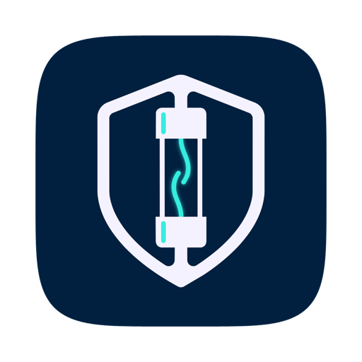

<div style="display: flex; justify-content: center; width: 100%;">
  
</div>

# Fuse - Keep your Environment Variables in One Encrypted Place

Every `.env` you have ever written, in one place on your machine, encrypted. Copy
one into a new project without hunting through old folders, compare development
against production, and put back a value you changed last week.

Workspaces keep one company's work away from another's. Inside a workspace you
have projects, inside projects you have folders for each environment, and inside
those you have the env files themselves.

Nothing leaves your machine. There is no account, no server and no cloud. One
encrypted file holds the lot, and only your master password opens it.

The command line side lives in
[fuse-env-manager-cli](https://github.com/OneAboveAll1964/fuse-env-manager-cli).

## How it works

The whole vault is a single file encrypted with AES-256-GCM. The key that
encrypts it is itself encrypted with a key stretched from your master password
through scrypt, so the password is never written to disk and changing it does not
re-encrypt everything.

If you ask Fuse to remember the device, that key is wrapped a second time with a
short PIN you choose and handed to the system keychain, which is Keychain on
macOS and DPAPI on Windows. Both are then needed to open the vault here: access
to your account, and the PIN. Someone who walks up to an unlocked laptop cannot
simply press a button and read your secrets.

Five wrong PINs and Fuse forgets the device altogether, so the master password is
required again. On a Mac with Touch ID you can let it stand in for typing the
PIN, which keeps the PIN in the keychain and releases it only after Touch ID
approves.

The `fuse` command never uses the device key. With the app closed it asks for the
master password itself.

## The command line

Most of the time you are not in the app, you are in a project folder. That is
what `fuse` is for.

```bash
cd ~/code/my-new-service
fuse pull                  # pick a file from the vault and write it here
fuse push .env             # send this folder's file back
fuse link                  # tie this folder to that file, so pull stops asking
fuse use production        # swap that folder to another environment in one step
fuse run -- npm start      # run with the variables injected, nothing on disk
fuse diff dev prod         # what is different between two environments
```

Install it from the app's **Command line** page, which writes a small launcher
into `/usr/local/bin` on macOS or `%LOCALAPPDATA%\Fuse\bin` on Windows. It runs
on the copy of Node inside the app, so nothing else has to be installed. On a
machine without the app, install
[the npm package](https://github.com/OneAboveAll1964/fuse-env-manager-cli) and
run `fuse init` to create a vault there.

While the app is open the command talks to it over a loopback socket and uses the
session that is already unlocked. With the app closed it opens the encrypted file
itself, asks for the master password once and caches it for fifteen minutes.
Everything the command can do is listed on that page, each with worked examples.

## Building

For development:

```bash
yarn install
yarn dev
```

To produce a real app:

```bash
yarn icons        # rebuild build/icon.{png,icns,ico} from build/logo-source.png
yarn build:mac    # dmg and zip
yarn build:win    # installer, portable and zip
```

`yarn build` bundles the command line tool into the app as well, so the Install
button has something to install.

## First run

1. Open Fuse and choose a master password. There is no way to recover it, so put
   it somewhere safe.
2. Leave **Start with sample data** on if you would like two example workspaces to
   look at first. Delete them whenever you like.
3. Make a project. Fuse creates development, staging and production folders with
   an empty `.env` in each.
4. Paste an existing file in with **Import**, or bring one in from a project
   folder with `fuse push .env`.

## Around the app

**Vault** is where you spend your time. The tree on the left and the panel on the
right work like a file manager: double click a folder to open it and you see only
what is inside, with breadcrumbs and back, forward and up buttons to move around.
Double click a file and you get its variables. The divider between the two is
draggable and remembers where you put it.

**Projects** shows what is in the current workspace, and double clicking one opens
it in the vault.

**Search** looks through keys, notes and values, though never the value of
anything marked as a secret.

**History** is every change you have made, with the previous value kept. Restoring
a deleted folder brings back everything that was in it.

**Import & export** moves part or all of the vault as a single zip, encrypted with
its own password if it holds secrets.

## Formats

Fuse reads and writes `.env`, JSON, YAML, TOML, shell exports, Java properties,
xcconfig, INI, CSV, Docker env-files, Kubernetes ConfigMaps and Secrets, GitHub
Actions blocks, Netlify commands and Dart defines.

The format is detected when you import and taken from the file's own setting when
you export, and either can be overridden. Quoted values with spaces, inline
comments, multiline values and commented-out lines all survive the round trip.

## Settings

**Automatic locking.** After a period of inactivity, and optionally when the
computer sleeps, when the window is minimised, or the moment Fuse loses focus.
The strictest option locks as soon as you click another app.

**Secrets.** Whether they are masked in lists, whether they go into quick exports,
and how long a copied value stays on the clipboard before Fuse wipes it.

**History.** How long entries are kept and how many. Turning it off means nothing
can be restored.

**Editor.** The format new files start as, whether values are quoted when written,
and whether variables sort alphabetically or keep the order you added them in. The
settings that change how something looks show you a live preview.

## Where things live

| Platform | Vault folder                         |
| -------- | ------------------------------------ |
| macOS    | `~/Library/Application Support/Fuse` |
| Windows  | `%APPDATA%\Fuse`                     |
| Linux    | `~/.config/Fuse`                     |

`FUSE_HOME` points both the app and the command somewhere else.

`vault.fuse` is the encrypted vault and `vault.fuse.bak` is the version before the
last write. `device.key` only exists if you asked to be remembered, with
`device.biometric` alongside it if you allowed Touch ID and `device.attempts`
counting wrong PINs. `bridge.json` holds the loopback port and token while the app
is open, and `session.json` is the command line's cached session. All of them are
written so that only your account can read them.

## If something is not right

- **You have forgotten the master password.** There is nothing anyone can do. That
  is the point of it. Restore from a zip export if you have one.
- **You have forgotten the device PIN.** Get it wrong five times, or press
  **Forget this device** in Settings, and Fuse falls back to the master password.
- **The `fuse` command is not found.** Install it from the Command line page, then
  open a new terminal. On Windows the folder it goes into may need adding to your
  PATH; the page tells you if it does.
- **The command asks for a password while the app is open.** The bridge is off, or
  the app is locked. Both are shown by `fuse status`.
- **A pull says the file already exists.** It shows you the difference first and
  asks whether to overwrite, merge or keep a backup. Pass `--yes` in a script to
  take the overwrite.
- **Something is missing after an import.** Imports never delete. Choose **Replace**
  rather than **Merge** if you meant the archive to win.

## Licence

MIT with an attribution clause. See [LICENSE](LICENSE). You are free to use,
change and redistribute Fuse, including in your own products, as long as you
credit the original author somewhere a user or reader can find it.

Made by [OneAboveAll1964](https://github.com/OneAboveAll1964).
